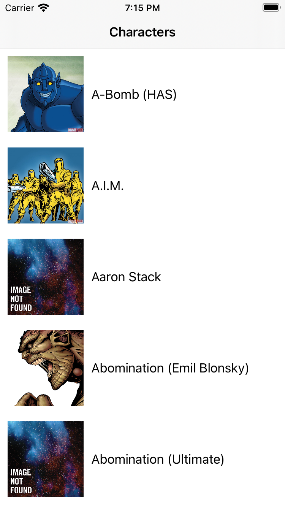
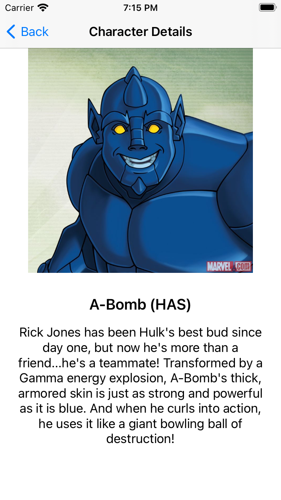

# Marvel
 ### Features:
  * Displays list of Marvel Characters
  * Displays detail of selected Marvel Character.
  
  ### Screenshots of application:
  
  
  

 ### Installation:
 Dependecies in the project are provided through Tuist which can be modified using `project.swift` file.
 To install the dependencies commands we have a build script 
 `build.sh` which has `tuist generate` command which generate the project and workspace from `project.swift` file. 
 You need to run `./build.sh` command on the terminal at project path. It will generate `.xcodeproj` file.
 We need to open project file and wait till following dependencies are loaded, then you can build the app and the run it on simulator.
 
Dependencies:
 * Moya: For creating Network call.
 * Kingfisher: For loading remote images.
 
## Architecture: MVVM + Clean

In this architecture we have code grouped in 3 layers
  * Presentation Layer
  * Domain Layer
  * Data Layer

## Presentation Layer:
Presentation Layer contains UI which are ViewControllers. ViewControllers are coordinated by ViewModels which execute one or many Use Cases. The Presentation Layer depends only on the Domain Layer.
The primary responsibility of the presentation layer is how the application would be presented to the end user.

## Domain Layer:
Domain layer is the independent layer which includes the business logic of the app . It Contains domain models, Use cases and repository protocol. Each use case executes a single business unit. It is totally independent and can be reused by other projects. It Fetches data from Repository through repository protocol.
Domain layer doesn’t know any thing about outer layers i.e presentation layer, Data layer.

## Data Layer:
Data Layer contains Repository Implementations and one or many Data Sources. Repositories are responsible for coordinating data from different Data Sources. Data Source can be Remote or Local. The Data Layer depends only on the Domain Layer. As This layer exposes a data source API to outside classes.

## Unit Test:
For Unit Test we have used XCTTest framework.
  * In Presentation layer, unit test is covered for View Models.
  * In Domain layer, unit test is covered for UseCases.
  * In Data layer, unit test is covered for Entities.
